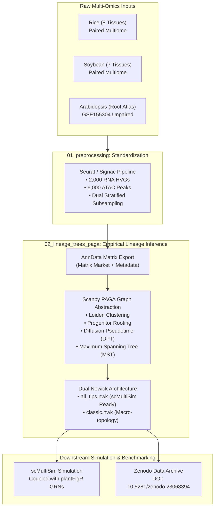

# plant-scMultiome-simulation

[](https://opensource.org/licenses/MIT)
[](https://doi.org/10.5281/zenodo.23068394)
[](https://www.python.org/)
[](https://www.r-project.org/)

**Standardized Single-Cell Multi-Omics Preprocessing and Empirical Lineage Tree Reconstruction for Plant In Silico Benchmarking**

---

## Overview

Benchmarking single-cell multiomics integration and simulation methods in plant biology requires empirically grounded biological priors. This repository provides reproducible pipelines for:

1. **Standardized Multiomic Preprocessing (3:1 Feature Ratio)**:
   - High-variance gene selection (2,000 RNA HVGs) and accessible chromatin peak selection (6,000 ATAC peaks) strictly maintaining the 3:1 multiomic ratio required by continuous trajectory simulators such as **scMultiSim** ([Zhang et al., *Nature Methods* 2023](https://doi.org/10.1038/s41592-023-02051-0)).
   - Dual-stratified sampling per cell type and batch (max 200 cells / type $\times$ batch) to eliminate memory explosion while preserving rare developmental lineages.

2. **Empirical PAGA Lineage Tree Extraction**:
   - Data-driven cell lineage trajectory extraction using **PAGA (Partition-based Graph Abstraction)** ([Wolf et al., *Genome Biology* 2019](https://doi.org/10.1186/s13059-019-1663-x)).
   - Dual Newick tree generation (`all_tips.nwk` vs `classic.nwk`) to guarantee exact matching with `scMultiSim` population allocation vectors.
   - Botanical progenitor rooting grounded in experimental plant developmental biology.

3. **Multi-Species Scope (16 Tissues Across Monocots & Dicots)**:
   - **Rice (*Oryza sativa*)**: 8 distinct organs/tissues (Bud, Flag leaf, Leaf, Root, SAM, Seed, Spikelet, Stem).
   - **Soybean (*Glycine max*)**: 7 tissues and developmental stages (Cotyledon, Early maturation, Early nodule, Globular, Heart, Hypocotyl, Root).
   - **Arabidopsis (*Arabidopsis thaliana*)**: Comprehensive 21-cluster Root single-cell atlas mapped across 6 canonical cell types.

---

## Pipeline Architecture



---

## Repository Structure

```
plant-scMultiome-simulation/
├── .gitignore
├── LICENSE                                    # MIT License
├── README.md                                  # Repository documentation
├── environment.yml                            # Conda environment definition
├── requirements.txt                           # Pip dependencies
├── 01_preprocessing/                          # R-based standardization pipelines
│   ├── README.md                              # Detailed preprocessing documentation
│   ├── preprocess_rice_all_tissues.R          # Rice 8-tissue multiome preprocessor
│   ├── preprocess_soybean_all_tissues.R       # Soybean 7-tissue multiome preprocessor
│   └── preprocess_arabidopsis_root.R          # Arabidopsis root atlas preprocessor
└── 02_lineage_trees_paga/                     # PAGA trajectory extraction pipelines
    ├── README.md                              # PAGA & Newick scientific documentation
    ├── arabidopsis/                           # Arabidopsis root workflow
    │   ├── export_arab_standardized_to_anndata.R
    │   ├── arab_paga_lineage_tree.py
    │   └── run_all_arab_paga.bat
    ├── rice/                                  # Rice 8-tissue workflow
    │   ├── export_rice_standardized_to_anndata.R
    │   ├── rice_paga_lineage_tree.py
    │   ├── run_all_rice_paga.bat
    │   └── run_rice_paga_cluster.pbs
    └── soybean/                               # Soybean 7-tissue workflow
        ├── export_soybean_standardized_to_anndata.R
        ├── soybean_paga_lineage_tree.py
        └── run_all_soybean_paga.bat
```

---

## Hardware Optimization & Memory Profile

Traditional raw single-cell multiomics analyses with tens of thousands of features often require large server nodes ($\ge$ 64 GB RAM). Our standardized dual-stratification pipeline:
- Limits memory consumption to **3.5–5.0 GB RAM per tissue**.
- Can be executed entirely on standard consumer workstations (e.g., Intel Core i7, 16 GB RAM) as well as High-Performance Computing (HPC) clusters (PBS/SLURM).

| Platform | Processor | RAM | Runtime (PAGA per Tissue) | Status |
| :--- | :--- | :--- | :--- | :--- |
| **Standard Laptop** | Intel Core i7 (6C/12T) | 16 GB DDR4 | 1.5 – 3.2 minutes | Fully Tested |
| **Hostel PC Workstation** | HP 280 G4, i7-8700 (6C/12T) | 16 GB DDR4 | 1.8 – 3.5 minutes | Compatible |
| **Ashoka HPC Cluster** | Intel Xeon Gold (48 cores) | 192 GB | < 1.0 minute | Batch Ready |

---

## Data Archival & Reproducibility (Zenodo)

Large multiomic count matrices, processed AnnData `.h5ad` objects, and high-resolution publication figures are deposited in Zenodo:
- **Repository Title**: *Single cell multiomics data simulation analysis results*
- **Persistent DOI**: [10.5281/zenodo.23068394](https://doi.org/10.5281/zenodo.23068394)
- **Archived Contents**:
  - `paga_lineage_trees_and_metadata.zip`: All `.nwk` trees, connectivity matrices, and cluster metadata.
  - `standardized_multiome_anndata_h5ad.zip`: Fully processed Scanpy AnnData objects.
  - `plantFigR_inferred_GRNs.zip`: Empirically inferred plant gene regulatory networks.

---

## Citations

If you use this pipeline or datasets in your research, please cite:

1. **scMultiSim Simulation Framework**:
   > Zhang, Z., Ji, Y. & Zhang, N. scMultiSim: in silico multi-omics data generation for single cells. *Nature Methods* **20**, 1908–1919 (2023). [https://doi.org/10.1038/s41592-023-02051-0](https://doi.org/10.1038/s41592-023-02051-0)

2. **PAGA Graph Abstraction**:
   > Wolf, F.A., Hamey, F.K., Plass, M. et al. PAGA: graph abstraction generates coarse-grained topologies of high-dimensional single-cell data. *Genome Biology* **20**, 59 (2019). [https://doi.org/10.1186/s13059-019-1663-x](https://doi.org/10.1186/s13059-019-1663-x)

3. **Data & Artifacts Repository**:
   > Sakthivel, K. & Mishra, D.C. Single cell multiomics data simulation analysis results. *Zenodo* (2026). [https://doi.org/10.5281/zenodo.23068394](https://doi.org/10.5281/zenodo.23068394)
